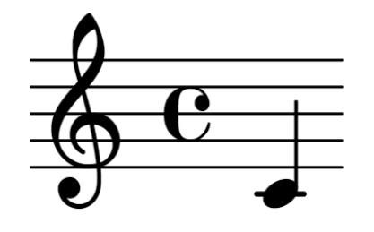
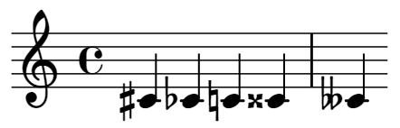

# LilyPond

- [LilyPond](#lilypond)
  - [LilyPondとは](#lilypondとは)
  - [LilyPondの導入](#lilypondの導入)
  - [LilyPondの使い方](#lilypondの使い方)
    - [音符の表示](#音符の表示)
    - [音部記号](#音部記号)
      - [ト音記号(G clef)](#ト音記号g-clef)
      - [へ音記号(F clef)](#へ音記号f-clef)
      - [ハ音記号(C clef)](#ハ音記号c-clef)
    - [音符](#音符)
    - [付点音符](#付点音符)
    - [付点休符](#付点休符)
    - [休符](#休符)
    - [変化記号](#変化記号)
  - [LilyPondによる楽譜作成例](#lilypondによる楽譜作成例)
    - [Hanon No.1](#hanon-no1)

## LilyPondとは

LilyPondとは, GPLライセンスのもとにフリーで公開されているクロスプラットフォームの楽譜作成ソフトウェアである. LilyPondはC++で記述され, Schemeライブラリでアセンブルされているが, ユーザ独自のカスタマイズや拡張も可能である.

## LilyPondの導入

ここでは, LilyPondの導入手順について述べる. ただし, エディタの導入が済んでいることを前提とする. また, 本記事ではエディタとしてVScodeを使用し, OSはWindowsであることを前提として述べる.

1. [LilyPondの公式ウェブサイト](https://lilypond.org/doc/v2.23/Documentation/web/download)から最新バージョンのソフトウェアをダウンロードする.
2. ダウンロードしたインスラーを実行してLilyPondをインストールする.

上記の手順でLilyPondをインストール出来たら動作確認を行う.
`cmd`で`lilypond --v`として以下のような出力が得られれば良い. 

```cmd
GNU LilyPond 2.24.3 (running Guile 2.2)

Copyright (c) 1996--2023 by
  Han-Wen Nienhuys <hanwen@xs4all.nl>
  Jan Nieuwenhuizen <janneke@gnu.org>
  and others.

This program is free software.  It is covered by the GNU General Public
License and you are welcome to change it and/or distribute copies of it
under certain conditions.  Invoke as `lilypond --warranty' for more
information.
```

LilyPondが正常に動作しない場合は, ローカル環境にパスを通すことで改善されるかもしれない.

## LilyPondの使い方

大まかな使い方としては以下の通りである.

1. エディタで楽譜をテキストで記述する (拡張子は".ly").
2. 以下の要領でコンパイルする.

```cmd
lilypond sample.ly
```

3. PDFとMDMIが出力される.

以降では, LilyPindにおける楽譜の記述方法について述べる.

### 音符の表示

以下の記述ではmidCが描画される. なお, ここではmidC=C4としている.

```cmd
{ c' }
```



音階はスペース区切りで以下のように指定する.


実際には小文字のアルファベットで音階を指定する.

```cmd
{ c' d g }
```


上の出力を見ると, d, gが1オクターブ下の音になっていることが分かる. これは, デフォルトで絶対音記法が指定されているためである. 

相対音記法にするには以下のように記述する. 

```cmd
\relative c' { c d g }
```


相対音記法では, 直前の音に一番近い側の音から選択される. 上記の例では, 最初の音はmidCに近い側の音から選択され, それ以降の音に関しても同様(厳密には直前の音の近傍音を選択)である. 

### 音部記号

音部記号はト音記号, へ音記号, ハ音記号に大別される. 音部記号の指定には`\clef`を使う. 

#### ト音記号(G clef)

ト音記号には, フレンチヴァイオリン記号, トレブル記号がある.

フレンチヴァイオリン記号：

```cmd
\relative c' {
    \clef french
    c1
}
```


トレブル記号：

```cmd
\relative c' {
    \clef treble
    c1
}
```


#### へ音記号(F clef)

ヘ音記号には, バリトン記号, バス記号, 低バス記号がある. 

バリトン記号：

```cmd
\relative c' {
    \clef varbaritone
    c1
}
```


バス記号：

```cmd
\relative c' {
    \clef bass
    c1
}
```


低バス記号：

```cmd
\relative c' {
    \clef subbass
    c1
}
```


#### ハ音記号(C clef)

ハ音記号には, ソプラノ記号, メゾソプラノ記号, アルト記号, テノール記号, バリトン記号がある. ただし, LilyPondにおいてデフォルトで提供されているものは

ソプラノ記号：

```cmd
\relative c' {
    \clef soprano
    c1
}
```


メゾソプラノ記号：

```cmd
\relative c' {
    \clef mezzosoprano
    c1
}
```


アルト記号：

```cmd
\relative c' {
    \clef alto
    c1
}
```


テノール記号：

```cmd
\relative c' {
    \clef tenor
    c1
}
```


バリトン記号：

```cmd
\relative c' {
    \clef baritone
    c1
}
```


### 音符

音符の長さは`c4`のように数字を付け加えて指定する. 

```cmd
\relative c' {
    \clef treble
    c1 c2 c4 c8 c16
}
```


### 付点音符

付点音符は`c.`のように`.`を付け加えて指定する. 

```cmd
\relative c' {
    \clef treble
    c2. c4. c8.
}
```


### 付点休符

付点休符は`r.`のように`.`を付け加えて指定する. 

```cmd
\relative c' {
    \clef treble
    r2. r4. r8.
}
```


### 休符

休符の長さは`r4`のように休符を指定する`r`に数字を付け加えて指定する. 

```cmd
\relative c' {
    \clef treble
    r1 r2 r4 r8 r16 r32
}
```


### 変化記号

変化記号には, シャープ, フラット, ダブルシャープ, ダブルフラット, ナチュラルがある. シャープは`cs`のように`s`を, フラットは`cf`のように`f`を, ダブルシャープは`css`のように`ss`を, ダブルフラットは`cff`のように`ff`を付け加えて指定する. また, ナチュラルは`cs cf c`のように(ダブル)シャープが(ダブル)フラットでキャンセルされた場合に自動で付加される. ただし, これらは設定言語が英語である場合(`\language "english"`)であり, その他の言語の場合は仕様が異なる点に注意されたい. 

```cmd
\relative c' {
    \clef treble 
    cs cf c css cff
}
```



## LilyPondによる楽譜作成例

### Hanon No.1

hanon01.ly：

```cmd
\version "2.24.3"
\language "english"

\paper {
    top-margin = 2.0\cm
    bottom-margin = 2.0\cm
    line-width = 17\cm
    indent = 0\cm
}

\header
{
  title = "Hanon No.1"
  composer = "Charles-Louis Hanon"
}

upper = \relative c'' {
  \time 2/4
  \clef treble
  \tempo 4 = 108
  \numericTimeSignature
  s1 | s1 | g,16 [ b c d ] e16 [ d c b ] |
  \break
  \stemUp
  a16 [ c d e ] f16 [ e d c ] | b16 [ d e f ] g16 [ f e d ] | c16 [ e f g ] a16 [ g f e ] | d16 [ f g a ] b16 [ a g f ] | e16 [ g a b ] c16 [ b a g ] |
  \break
  \stemUp
  f16 [ a b c ] 
  \stemDown
  d16 [ c b a ] | 
  g16 [ b c d ] e16 [ d c b ] | a16 [ c d e ] f16 [ e d c ] | b16 [ d e f ] g16 [ f e d ] \bar "||" g16^\markup{\tiny 5} [ e^\markup{\tiny 4} d^\markup{\tiny 3} c^\markup{\tiny 2} ] b16^\markup{\tiny 1} [ c^\markup{\tiny 2} d^\markup{\tiny 3} e^\markup{\tiny 4} ] |
  \break
  \stemDown
  f16^\markup{\tiny 5} [ d c b ] a16 [ b c d ] | e16 [ c b a ] 
  \stemUp
  g16 [ a b c ] | d16 [ b a g ] f16 [ g a b ] | c16 [ a g f ] e16 [ f g a ] | b16 [ g f e ] d16 [ e f g ] |
  \break
  \stemUp
  a16 [ f e d ] c16 [ d e f ] | g16 [ e d c ] b16 [ c d e ] | f16 [ d c b ] a16 [ b c d ] | e16 [ c b a ] g16 [ a b c ] | s1 | s1 | s1 |
}

lower = \relative c {
  \time 2/4
  \clef bass
  << \new Voice {
    \stemUp
    c16^\markup{\tiny 1} [ e^\markup{\tiny 2} f^\markup{\tiny 3} g^\markup{\tiny 4} ] a16^\markup{\tiny 5} [ g^\markup{\tiny 4} f^\markup{\tiny 3} e^\markup{\tiny 2} ] }
    \new Voice {
      \stemDown
      c,16_\markup{\tiny 5} [ e_\markup{\tiny 4} f_\markup{\tiny 3} g_\markup{\tiny 2} ] a16_\markup{\tiny 1} [ g f e] }
  >> |
  << \new Voice {
    \stemUp
    d'16^\markup{\tiny 1} [ f g a ] b16 [ a g f ] }
    \new Voice {
      \stemDown
      d,16_\markup{\tiny 5} [ f g a ] b16 [ a g f ] } 
  >> |
  << \new Voice {
    \stemUp
    e'16 [ g a b ] c16 [ b a g ] } 
    \new Voice {
      \stemDown
      e,16 [ g a b ] c16 [ b a g ] }
  >> | 
  << \new Voice {
    \stemUp
    f'16 [ a b c ] d16 [ c b a ] }
    \new Voice {
      \stemDown
      f,16 [ a b c ] d16 [ c b a ] }
  >> | 
  g16 [ b c d ] e16 [ d c b ] |
  \break
  \stemUp
  a16 [ c d e ] 
  \stemDown
  f16 [ e d c ] |
  b16 [ d e f ] g16 [ f e d ] | c16 [ e f g ] a16 [ g f e ] | d16 [ f g a ] b16 [ a g f ] | e16 [ g a b ] c16 [ b a g ] |
  \break
  \stemDown
  f16 [ a b c ] d16 [ c b a ] | g16 [ b c d ] e16 [ d c b ] | a16 [ c d e ] f16 [ e d c ] | b16 [ d e f ] g16 [ f e d ] \bar "||" g16_\markup{\tiny 1} [ e_\markup{\tiny 2} d_\markup{\tiny 3} c_\markup{\tiny 2} ] b16_\markup{\tiny 1} [ c_\markup{\tiny 2} d_\markup{\tiny 3} e_\markup{\tiny 4} ] |
  \break
  \stemDown
  f16_\markup{\tiny 1} [ d c b ] a16 [ b c d ] | e16 [ c b a ] g16 [ a b c ] | d16 [ b a g ] f16 [ g a b ] | c16 [ a g f ] e16 [ f g a ] | b16 [ g f e ] d16 [ e f g ] |
  \break
  \stemDown
  a16 [ f e d ] c16 [ d e f ] | g16 [ e d c ] 
  \stemUp
  b16 [ c d e ] | f16 [ d c b ] a16 [ b c d ] | e16 [ c b a ] g16 [ a b c ] |
  << \new Voice {
    \stemUp
    d'16 [ b a g ] f16 [ g a b ] }
    \new Voice {
      \stemDown 
      d,16 [ b a g ] f16 [ g a b ] }
  >> |
  \break
  << \new Voice {
    \stemUp
    c'16 [ a g f ] e16 [ f g a ] }
    \new Voice {
      \stemDown 
      c,16 [ a g f ] e16 [ f g a ] }
  >> |
  << \new Voice {
    \stemUp
    b'16 [ g f e ] d16 [ e f g ] }
    \new Voice {
      \stemDown 
      b,16 [ g f e ] d16 [ e f g ] }
  >> |
  << \new Voice {
    \stemUp
    a'16 [ f e d ] c16 [ d e f ] }
    \new Voice {
      \stemDown 
      a,16 [ f e d ] c16 [ d e f ] }
  >> |
  << \new Voice {
    \stemUp
    g'16 [ e d c ] b16 [ c d e ] }
    \new Voice {
      \stemDown 
      g,16 [ e d c ] b16 [ c d e ] }
  >> |
  \bar ":|." 
  << \new Voice {
    \stemUp
    c'2 }
    \new Voice {
      \stemDown
      c,2 } 
  >> \bar "|."
}

\score {
  \context PianoStaff <<
    \new Staff {
      \upper
    }
    \new Staff {
      \lower
    }
  >>
  \layout {
    \override Score.Clef.break-visibility = #all-invisible
    \override Score.KeySignature.break-visibility = #all-invisible
    \override Score.SystemStartBar.collapse-height = #1
  }
  \midi {}
}
```

hanon01.pdf：


MIDIをACCとMP3に変換したものを以下に示す.

iOS, Android：[hanon01.acc](audio/hanon.acc)
Windows, Mac：[hanon01.mp3](audio/hanon01.mp3)
